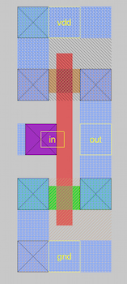
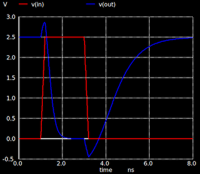
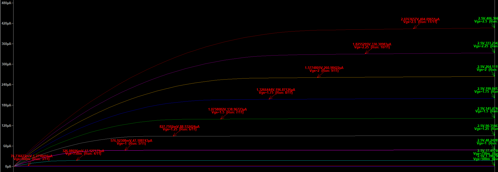
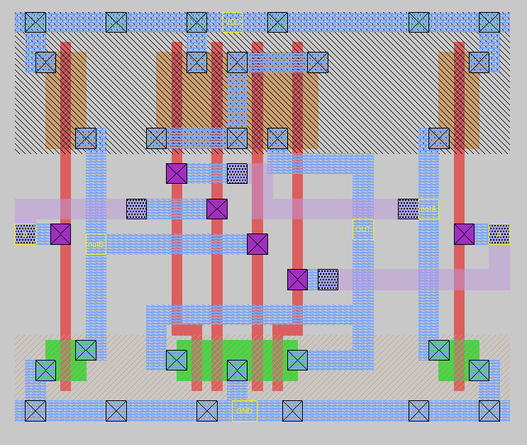
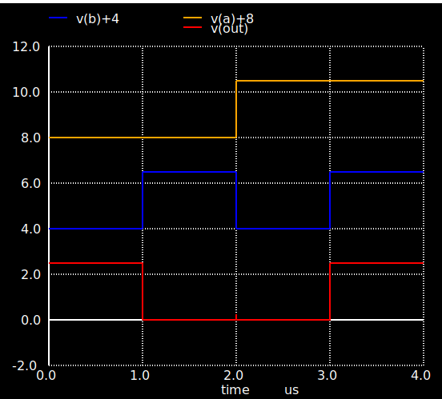
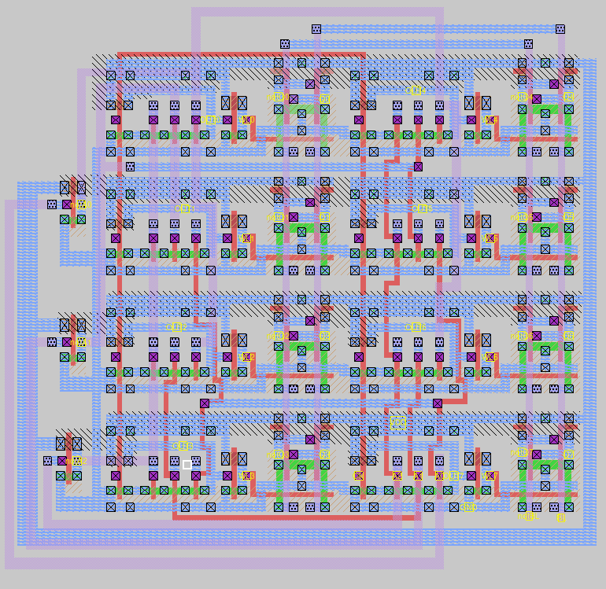
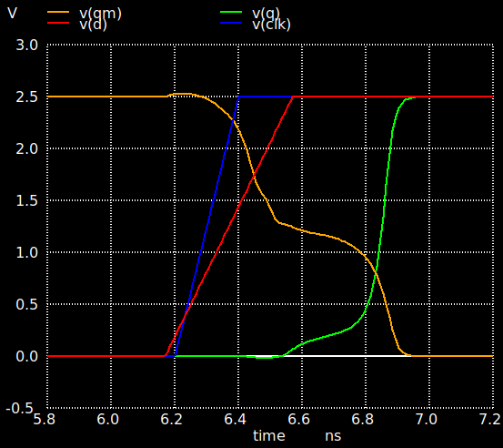
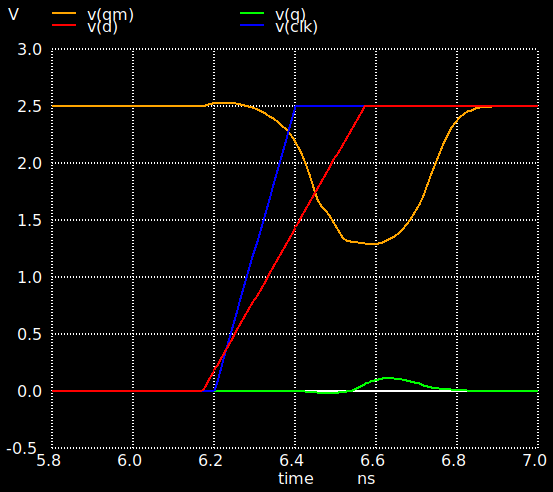

# Digital Systems VLSI Design

## 📌 Overview

This repository contains a comprehensive series of assignments and projects for the **VLSI Design** course ECE327. The work covers the entire design flow of CMOS digital circuits: from transistor characterization and logic gate layout to the design of complex systems like **Memory Cells (SRAM)** and **Decoders**.

---

## 📂 Project Structure

> [!NOTE]
> I've included representative graphics sourced from the detailed PDF reports to provide a quick visual example of each lab.

### 1️⃣ Set 1: CMOS Inverter Design & Timing
* **Design:** Minimum-area CMOS inverter layout in MAGIC (`W=3µm, L=2µm`).
* **Simulation:** SPICE netlist extraction and verification.
* **Analysis:** Measurement of propagation delays ($t_{pHL}, t_{pLH}$) and rise/fall ($t_{rise}, t_{fall}$) times.
#### 🖼️ Representative Graphics
<table align="center">
  <tr>
    <td align="center"><b>💾 Inverter Layout</b></td>
    <td align="center"><b>📈 Propagation Delay Analysis</b></td>
  </tr>
  <tr>
    <td></td>
    <td></td>
  </tr>
</table>

### 2️⃣ Set 2: Transistor Characterization & Noise Margins
* **Transistor Level:** DC analysis of NMOS/PMOS ($I_{ds}$ vs $V_{gs}/V_{ds}$) and calculation of equivalent resistances ($R_{eq}$).
* **Inverter VTC:** Plotting the Voltage Transfer Curve to determine Noise Margins ($NM_L, NM_H$) and Switching Threshold ($V_M$).
* **Scaling:** Impact of $V_{dd}$ scaling on power consumption and robustness.
#### 🖼️ Representative Graphics

<table align="center">
  <tr>
    <td align="center"><b>🔬 NMOS Transistor I-V Curves</b></td>
  </tr>
  <tr>
    <td></td>
  </tr>
</table>

### 3️⃣ Set 3: CMOS Logic Gate Design and Analysis
* **Gate Design:** Layout implementation of complex gates: `OHdecoder`, `MUX`, `OAI31`, `XNOR`, and `AOI21`.
* **Optimization:** Transistor sizing for symmetric pull-up/pull-down networks ($6.5k\Omega$ target).
* **Modeling:** Calculation of diffusion capacitances and **Elmore Delay** analysis for worst-case transitions.

#### 🖼️ Representative Graphics
<table align="center">
  <tr>
    <td align="center"><b>💾 Complex Gate Layout (XNOR)</b></td>
    <td align="center"><b>📈 Functional Verification </b></td>
  </tr>
  <tr>
    <td></td>
    <td></td>
  </tr>
</table>

### 4️⃣ Set 4: System Level - Decoder & 6T SRAM Cell
* **Hierarchical Design:** Large-scale integration of a complete memory subsystem using hierarchical components.
* **Address Decoding:** Implementation of an **8-wordline Decoder** based on high-speed dynamic logic (NOR/NAND configurations).
* **Memory Core:** Design of a **6-Transistor (6T) SRAM cell**, optimized for read/write stability and minimum area footprint.
* **System Integration:** Verification of the interaction between the decoder and the memory cell.
#### 🖼️ Representative Graphics

<table align="center">
  <tr>
    <td align="center"><b>💾 8-SRAM Layout with NAND Logic Decoder </b></td>
  </tr>
  <tr>
    <td></td>
  </tr>
</table>

### 5️⃣ Set 5: Sequential Logic Design - Latches & Flip-Flops
* **Circuit Design:** Transistor-level implementation of a **Latch with Weak Feedback** and a **Master-Slave D Flip-Flop (MS-DFF)**.
* **Timing Characterization:** Αnalysis of critical timing parameters, including **CLK-to-Q propagation delay**, rise/fall times, and internal node behavior.
* **Constraint Analysis:** Determination of **Setup and Hold time limits** to ensure stable data latching.
* **Metastability Study:** Investigation of circuit behavior under timing violations and the regenerative feedback's role in preventing metastable states.

#### 🖼️ Representative Graphics
<table align="center">
  <tr>
    <td colspan="2" align="center"><b>📈 Metastability Investigation</b></td>
  </tr>
  <tr>
    <td align="center">
      
       <i>Stable Operation</i>
    </td>
    <td align="center">
      
       <i>Metastable State</i>
    </td>
  </tr>
</table>

---

## 📝 Documentation

Each folder contains:
* Includes the MAGIC Layouts in `.mag` files.
* Includes circuit netlists in **`.spice`** (NGSPICE), and **`.cir`** (LTspice) formats. And the **`.sp`** contains the **MOSIS-TSMC 0.25µm** technology file.
* Detailed Reports (PDF) with waveforms, layouts, and theoretical analysis.

> [`NOTE`]
> Only the first 2 Reports are in greek, the last 3 are in english.
---

## 🛠️ Development Tools

| Category | Tools |
| :--- | :--- |
| **Design** | `MAGIC VLSI` |
| **Simulation** | `NGSPICE / LTSPICE` |

---
